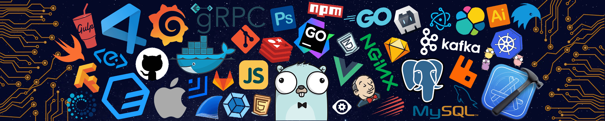

<h1 align="center"> வணக்கம் (Vanakkam), I am Siva Prakash </h1>
<h3 align="center">I'm an aspiring data scientist from India ❤️</h3>

I am a motivated student pursuing bachelor of computer applications student at Madras University, Chennai. After discovering my passion for analyzing data to extract useful information that can lead to data driven decision-making pushed me to the data science domain. And now currently I am working with some self paced mini-projects in the field of data analytics, machine learning, deep learning, natural language processing and computer vision.

<p align="center">
  
  
  
  
  
  
  
</p>

<h2>😉 About Me : </h2>

- 🔭 I’m currently working on **Machine Learning**
- 🌱 I’m currently learning **Natural Language Processing**
- 👯 I’m looking to collaborate on **Data Analytics**
- 😄 Pronouns : **Prakash**
- 💬 Ask me about : **Anything**
- ⚡ Fun fact : **I listen to music atleast 30 mins/day**

#### A little more about me...

```python
from datetime import date

details = {
            "Name": 'Siva Prakash',
            "Age": date.today().year - 2001,
            "Pronouns": ["Siva", "Prakash", "He", "Him"],
            "Description": ['Passionate', 'Optimistic',
                            'Energetic', 'Team Player'
                            'and a lot more'],
            "Education":
             [
                {
                    "College": 'Apollo arts and science college',
                    "Year": range(2019, 2023)
                },
                {   "School": 'Seventh Day Adventist Matriculation Higher Secondary School',
                    "Year": range(2017, 2020)
                }
             ]
           }

for key, value in details.items():
    print(f"{key} : {value}")
```

<h2 align="left">📱 Connect with Me :</h2>
<p>
  <a href="mailto:thalapathysp25@gmail.com"></a>
  <a href="https://www.linkedin.com/in/prakashdeveloper"></a>
  <a href="https://www.instagram.com/Simply_Siva_Prakash/"></a>
  <a href="https://twitter.com/Prakashdev03"></a>
  <a href="https://www.hackerrank.com/prakashdeveloper"></a>
  <a href="https://leetcode.com/Prakashdeveloper03/"></a>
  <a href="https://auth.geeksforgeeks.org/user/prakashdev03/practice"></a>
  <a href="https://www.coursera.org/user/c769b064d520324728a21b58cf4c7871"></a>
  <a href="https://www.udemy.com/user/siva-prakash-120/"></a>
  <a href="https://t.me/prakashdev03"></a>
  <a href="https://prakashdeveloper03.github.io/"></a>
</p>

<h2 align="left">🚀 Languages and Tools :</h2>

### 👨‍💻 Programming languages

<p>
    
    
    
    
    
    
    
</p>

### 🧰 Frameworks and libraries

<p>
    
    
    
    
    
    
    
    
    
    
    
    
    
    
    
    
    
    
</p>

### 🗄️ Databases and cloud hosting

<p>
    
    
    
    
    
    
    
</p>

### 💻 Software and tools

<p>
    
    
    
    
    
    
    
    
    
    
    
    
    
    
    
    
    
    
    
</p>

<h2>🎯 Statistics and Languages :</h2>
<details open>
  <summary>GitHub Profile Stats</summary>
  <br/>
    
    
  <br/>
</details>

<details open>
  <summary>GitHub Profile Streak</summary>
  <br/>
  <p align="center">
    
  </p>
  <br/>
</details>

<details open>
  <summary>GitHub Trophy Stats</summary>
  <br/>
  <p align="center">
    
  </p>
  <br/>
</details>

<details open>
  <summary>GitHub Contributions Graph</summary>
  <br/>
  <p align="center">
    
  </p>
</details>
